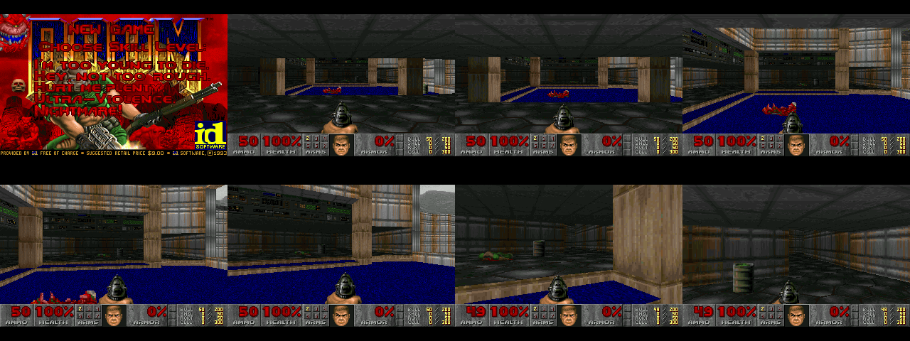

# STM32 Forge — DOOM on STM32

A modular web IDE for STM32 that builds real firmware in the browser or with
`arm-none-eabi-gcc`, shows the linker's real memory usage per chip, flashes the board from the browser,
and runs the actual DOOM engine, both in its emulator panel and on an
STM32H743.

| Target | Core | Flash | RAM | DOOM |
| --- | --- | --- | --- | --- |
| STM32H743IITx | Cortex-M7, 400 MHz | 2 MB | 1 MB | runs (707 KB zone heap) |
| STM32F103C8T6 (Blue Pill) | Cortex-M3, 72 MHz | 64 KB | 20 KB | does not fit: the linker reports flash 467 % and RAM 4872 % |

## Online demo and local IDE

GitHub Pages serves the complete static demo: the DOOM WebAssembly game, editable
source browser, browser-side H743 compiler, linker reports, and prebuilt firmware.
Source edits are saved as drafts in the current browser. The Build button compiles
those drafts in the browser using a pinned WebAssembly ARM toolchain; no server or
workflow runs. The first build downloads about 98 MB of compiler assets from
unpkg, which the browser caches. Flashing and serial use Web Serial/WebUSB in
Chrome or Edge on HTTPS.

Pages serves the checked-in `main:/docs` folder. After editing the site, run
`node tools/bundle_ide.mjs && node tools/publish_static.mjs`, then commit the
updated static tree. There are no GitHub Actions workflows for building or
publishing this site.

**Play**: Run starts directly in E1M1. Click the game screen, then use the
arrow keys or WASD to move, Ctrl or F to fire, Space to use, and Shift to run.
The Game brightness slider brightens the emulator screen and remembers its
setting in this browser.

**Firmware examples**: choose an example from the grouped selector. Each project
has its own `firmware/projects/<example>/main.c` entry point and can be built and
flashed independently. The catalog at `firmware/projects/catalog.json` supplies
the menu description, category, board support, and editor entry file. Included
examples cover DOOM, LED blinking, button input, UART echo, timer-driven status,
an ILI9341 color cycle, and the FreeRTOS LED/serial task example. FreeRTOS uses
the upstream 11.1.0 kernel and GCC Cortex-M7 r0p1 port on the H743; its virtual
board preview executes the task C functions and shows their delays and states.
The **Clock diagram** button opens a movable clock-tree pane calculated from
the selected board's `board.c`; all IDE panes can be floated, moved, resized,
and docked back into the workspace.

**Rebuild and flash H743 changes**: edit firmware or engine sources in the IDE,
press **Build**, then select the resulting image in **Flash…**. The build uses
the current editor buffers, reports compiler/linker memory usage, and creates
the `.bin` in the browser. The image can be flashed directly over UART or USB
DFU without downloading an artifact or sending code to a server.

```sh
node server/forge_server.mjs            # then open http://localhost:8732/
```

The Node server serves the IDE, saves edited files to the checkout, and invokes
`make` with `arm-none-eabi-gcc` (on `PATH` or in `ARM_GCC_PATH`). Install the
[Arm GNU Toolchain](https://developer.arm.com/downloads/-/arm-gnu-toolchain-downloads)
to enable firmware builds. The checked-in `ide/forge.js` bundle is regenerated
with `node tools/bundle_ide.mjs` after editing `ide/`.

On Pages, source edits remain local browser drafts. The optional Node server
still offers checkout saves and native GCC builds for local development. The
prebuilt H743 DOOM and blinky images remain available for flashing directly.

Flashing and the serial console use Web Serial and WebUSB, which need Chrome
or Edge.

## What is real

- **DOOM**: id Software's engine (the [doomgeneric](https://github.com/ozkl/doomgeneric)
  port, GPLv2) with the shareware `DOOM1.WAD`. The same sources are compiled
  to WebAssembly for the emulator and to ARM for the H743.
- **Builds**: the static IDE runs pinned WebAssembly Clang/LLD locally in the
  browser, compiles source files plus unsaved editor buffers, links with
  `firmware/targets/h743/h743.ld`, enforces the zone-heap limit, and produces
  the `.bin` image in browser memory. All H743 examples in the catalog can be
  built directly in the browser. The optional local Node server uses native Arm
  GCC.
- **Memory budget**: the emulator runs DOOM with its heap split into the
  same banks, at the same sizes, as the H743 firmware link. On the Blue Pill
  budget it fails the same way the real chip would.
- **Flashing**: the chips' ROM bootloaders.
  - UART bootloader, [AN3155](https://www.st.com/resource/en/application_note/an3155-usart-protocol-used-in-the-stm32-bootloader-stmicroelectronics.pdf),
    over Web Serial: both chips.
  - USB DFU (DfuSe) over WebUSB: STM32H743 only (the F103 ROM has no USB
    bootloader).

## STM32H743 hardware

Default wiring (change it in `firmware/targets/h743/board_config.h`):

| Function | Pins |
| --- | --- |
| ILI9341 320×240 SPI LCD | SPI1: SCK PA5, MOSI PA7, CS PA4, D/C PB1, RST PB0, backlight PB2 |
| microSD (4-bit) | SDMMC1: D0–D3 PC8–PC11, CK PC12, CMD PD2 |
| Console + keyboard, bootloader | USART1: TX PA9, RX PA10, 115200 8N1 |
| USB DFU | PA11 / PA12 |
| Buttons (optional, active low) | PE0–PE7: up, down, left, right, fire, use, enter, esc |
| LED | PC13 |

Clocks come from the internal HSI (PLL at 400 MHz), so the crystal
frequency doesn't matter.

**SD card**: FAT32-format a microSD card and copy `sim/doom1.wad` to it as
`DOOM1.WAD`. The WAD is 4 MB, more than the 2 MB of internal flash. Config
and savegames are written to the card as well.

**Playing**: use the push buttons, or open the serial monitor in the IDE,
tick **keys → board**, click the emulator screen and play with the keyboard.
Any serial terminal also works: arrow keys or WASD, `f` fire, space use,
Enter, Esc.

### Memory layout

DOOM needs about 700 KB of heap plus about 250 KB of static data, more than
any single SRAM bank on the H743, so `firmware/targets/h743/h743.ld` spreads
it over every bank:

| Region | Contents |
| --- | --- |
| FLASH 2 MB | code, read-only data, the DOOM state table |
| ITCM 64 KB | render arrays (`openings`, `viewangletox`) |
| DTCM 128 KB | `.data`, `.bss`, 48 KB malloc heap, 16 KB stack, zone part 0 |
| AXI SRAM 512 KB | `visplanes` and other renderer statics, zone part 1 |
| SRAM1–3 288 KB | zone part 2 |
| SRAM4 64 KB | FatFs objects, LCD line buffers, other render arrays |

The linker asserts that the zone is at least 704 KB. That is the smallest
size that ran every demo in `tests/sim_headless.mjs`.

Engine changes, all behind `#ifdef`s:

- `DG_ZONE_PROVIDER`: the platform supplies the zone, possibly split across
  banks with gaps between them.
- `DG_ZONE_STATIC_TOP`: non-purgeable blocks are allocated from the top of
  the zone. This stops fragmentation and cut the minimum zone from about
  6 MB to 704 KB.
- `DG_NO_WIPE`: drops the melt wipe, which needs 128 KB of extra screen
  buffers.
- `DG_NO_SCREENBUFFER`: the platform reads the 8-bit frame buffer directly.
- `DG_STATES_IN_FLASH`: keeps the 27 KB state table in flash.

## Blue Pill hardware

LED on PC13 and USART1 on PA9/PA10. The Blinky project (5 KB of flash,
4.5 KB of RAM) blinks the LED and prints a counter. Building DOOM for it is
kept as a project so that the linker shows why it can't fit.

## Flashing

1. Set BOOT0 high (Blue Pill: jumper BOOT0 = 1) and reset the board.
2. In the IDE, choose **Flash…**, then either **UART bootloader** or **USB DFU**
   (H743 only), then **Connect & flash**. The IDE erases, programs, verifies
   and starts the firmware.
3. Set BOOT0 low again for normal start-up.

For the UART bootloader, wire a 3.3 V USB-UART adapter: TX → PA10,
RX → PA9, GND.

## Tests

```sh
tests/run_all.sh
```

- **Firmware builds** for all four target/project combinations. `bluepill/doom`
  must fail with flash and RAM overflow.
- **Flashing protocols** (`node --test tests/`): AN3155 and DfuSe program the
  built images into simulated STM32 ROM bootloaders, and flash contents are
  compared byte for byte.
- **DOOM wasm, headless** (`tests/sim_headless.mjs`): demo playback with
  zone integrity checks, including the exact H743 bank layout.
- **H743 firmware emulator** (`tests/emu/h743_emu.py`): runs the real
  `firmware.elf` on a Cortex-M7 emulator (Unicorn) with RCC, PWR, GPIO,
  USART1, SPI1 and SDMMC1 modelled. The SD card image holds `DOOM1.WAD`, and
  the ILI9341 SPI stream is decoded into PNG frames. The firmware boots,
  mounts FAT, loads the WAD, and starts and plays E1M1 through its UART key
  protocol. This optional emulator test uses Python tooling; it is not needed
  by the online demo, local IDE server, firmware, or flashing path.



Not yet done: running on a physical board. Everything above the silicon has
been tested (the toolchain output, the bootloader protocols against
simulated bootloaders, and the complete firmware on an emulated
H743). Board-specific parts (pins, LCD, SD socket) may need adjusting in
`board_config.h`.

## Layout

```
index.html, ide/            web IDE (CodeMirror editor, emulator, flashing, serial)
ide/flash/                  AN3155 (Web Serial) and DfuSe (WebUSB) flashers
server/forge_server.mjs     local IDE/build server (Node.js)
engine/doomgeneric/         DOOM engine (GPLv2)
engine/platform/dg_web.c    emulator platform layer
sim/                        WebAssembly build (sim/build.sh), DOOM1.WAD (+ .js copy)
firmware/Makefile           make TARGET=h743|bluepill PROJECT=doom|blinky
firmware/targets/h743/      H743 board, LCD, SD, syscalls, DOOM platform, linker script
firmware/targets/bluepill/  Blue Pill board, syscalls, linker script
firmware/projects/blinky/   blinky for both boards
firmware/third_party/       CMSIS, STM32H7 HAL subset, FatFs
firmware/prebuilt/          built images + manifest
tests/                      regression suite
```

## Licensing

The DOOM engine is GPLv2 (`engine/doomgeneric/LICENSE`). `sim/doom1.wad` is
the unmodified DOOM shareware v1.9 IWAD, which may be freely redistributed.
CMSIS and the STM32 device headers are Apache-2.0, the STM32H7 HAL is
BSD-3-Clause, and FatFs uses its own BSD-style licence; each licence file is
in `firmware/third_party/`.
