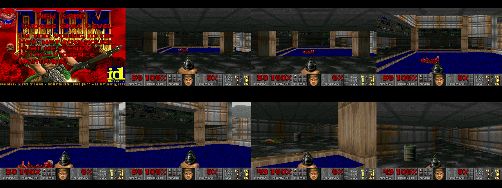

# STM32 Forge — DOOM on STM32

A modular web IDE for STM32 that builds real firmware in the browser or with
`arm-none-eabi-gcc`, shows the linker's real memory usage per chip, flashes the board from the browser,
and runs the actual DOOM engine, both in its emulator panel and on an
STM32H743.

| Target | Core | Flash | RAM | DOOM |
| --- | --- | --- | --- | --- |
| STM32H743IITx | Cortex-M7, 400 MHz | 2 MB | 1 MB | runs (707 KB zone heap) |
| STM32F103C8T6 (Blue Pill) | Cortex-M3, 72 MHz | 64 KB | 20 KB | does not fit: the linker reports flash 467 % and RAM 4872 % |
| STM32F401RE (Nucleo-F401RE) | Cortex-M4, 84 MHz | 512 KB | 96 KB | does not fit (96 KB of RAM); Blinky, flashed instantly over USB |

## Online demo and local IDE

GitHub Pages serves the complete static demo: the DOOM WebAssembly game, editable
source browser, browser-side H743 and Nucleo-F401RE compiler, linker reports,
prebuilt firmware, and instant flashing. The site is self-contained: the compiler,
editor and fonts are vendored under `vendor/` (see `vendor/README.md`), so it
loads nothing from other hosts. Source edits autosave as drafts in the current
browser. A floating change notice lists modified sample files and can restore them
to their original contents. The Build button compiles those drafts in the browser
using the pinned WebAssembly ARM toolchain; no server or workflow runs. The first
build downloads about 98 MB of compiler files from the site, which the browser
caches. Flashing and serial use WebUSB/Web Serial in Chrome or Edge on HTTPS.

Pages serves the checked-in `main:/docs` folder. After editing the site, run
`node tools/bundle_ide.mjs && node tools/publish_static.mjs`, then commit the
updated static tree. There are no GitHub Actions workflows for building or
publishing this site.

**Play**: Run starts directly in E1M1. Click the game screen, then use the
arrow keys or WASD to move, Ctrl or F to fire, Space to use, and Shift to run.
The Game brightness slider brightens the emulator screen and remembers its
setting in this browser.

**Firmware examples**: choose an example from the grouped selector. Each project
has its own `firmware/projects/<example>/main.c` entry point and can be built and
flashed independently. The catalog at `firmware/projects/catalog.json` supplies
the menu description, category, board support, and editor entry file. Included
examples cover DOOM, LED blinking, button input, UART echo, timer-driven status,
an ILI9341 color cycle, and the FreeRTOS LED/serial task example. FreeRTOS uses
the upstream 11.1.0 kernel and GCC Cortex-M7 r0p1 port on the H743; its virtual
board preview executes the task C functions and shows their delays and states.
The **Clock diagram** button opens a movable clock-tree pane calculated from
the selected board's `board.c`; all IDE panes can be floated, moved, resized,
and docked back into the workspace.

**Rebuild and flash changes**: edit firmware or engine sources in the IDE and
press **Flash**. Flash always uploads firmware built from the sources as they
are now: when files that go into the selected board and example changed since
the last build, it builds them first (H743 and Nucleo-F401RE, in the browser);
unchanged sources use this session's build or the prebuilt image. A failed
build stops the flash instead of falling back to an older image. **Build**
alone still compiles and reports compiler/linker memory usage. Nothing is
downloaded or sent to a server; the image goes over the ST-Link, UART or USB
DFU. With the build server, Flash always runs `make` first, since files can
also change outside the IDE.

```sh
node server/forge_server.mjs            # then open http://localhost:8732/
```

The Node server serves the IDE, saves edited files to the checkout, and invokes
`make` with `arm-none-eabi-gcc` (on `PATH` or in `ARM_GCC_PATH`). Install the
[Arm GNU Toolchain](https://developer.arm.com/downloads/-/arm-gnu-toolchain-downloads)
to enable firmware builds. The checked-in `ide/forge.js` bundle is regenerated
with `node tools/bundle_ide.mjs` after editing `ide/`.

On Pages, source edits remain local browser drafts. The optional Node server
still offers checkout saves and native GCC builds for local development. The
prebuilt H743 DOOM and blinky images remain available for flashing directly.

Flashing and the serial console use Web Serial and WebUSB, which need Chrome
or Edge.

## What is real

- **DOOM**: id Software's engine (the [doomgeneric](https://github.com/ozkl/doomgeneric)
  port, GPLv2) with the shareware `DOOM1.WAD`. The same sources are compiled
  to WebAssembly for the emulator and to ARM for the H743.
- **Builds**: the static IDE runs pinned WebAssembly Clang/LLD locally in the
  browser, compiles source files plus unsaved editor buffers, links with
  `firmware/targets/h743/h743.ld`, enforces the zone-heap limit, and produces
  the `.bin` image in browser memory. All H743 examples in the catalog, and
  Blinky for the Nucleo-F401RE, can be built directly in the browser. The
  optional local Node server uses native Arm GCC.
- **Memory budget**: the emulator runs DOOM with its heap split into the
  same banks, at the same sizes, as the H743 firmware link. On the Blue Pill
  budget it fails the same way the real chip would.
- **Flashing**: an ST-Link (on-board on a Nucleo, or a standalone STLINK-V3
  on the SWD pins), or the chips' ROM bootloaders.
  - Instant flash, over WebUSB to the ST-Link (`ide/flash/stlink.js`): SWD
    halt, sector erase, programming by a small routine run from SRAM,
    read-back verify and reset. STM32F4 (Nucleo-F401RE, F411, F4xx) and
    STM32H743/753 (both 1 MB flash banks, 256-bit flash words, loader in
    AXI SRAM).
  - UART bootloader, [AN3155](https://www.st.com/resource/en/application_note/an3155-usart-protocol-used-in-the-stm32-bootloader-stmicroelectronics.pdf),
    over Web Serial: both chips.
  - USB DFU (DfuSe) over WebUSB: STM32H743 only (the F103 ROM has no USB
    bootloader).

## STM32H743 hardware

Default wiring (change it in `firmware/targets/h743/board_config.h`):

| Function | Pins |
| --- | --- |
| ILI9341 320×240 SPI LCD | SPI1: SCK PA5, MOSI PA7, CS PA4, D/C PB1, RST PB0, backlight PB2 |
| microSD (4-bit) | SDMMC1: D0–D3 PC8–PC11, CK PC12, CMD PD2 |
| Console + keyboard, bootloader | USART1: TX PA9, RX PA10, 115200 8N1 |
| USB DFU | PA11 / PA12 |
| Buttons (optional, active low) | PE0–PE7: up, down, left, right, fire, use, enter, esc |
| LED | PC13 |

Clocks come from the internal HSI (PLL at 400 MHz), so the crystal
frequency doesn't matter.

### SD card & game asset storage

The DOOM entry point (`firmware/targets/h743/dg_stm32.c`) boots and mounts a microSD card for several key architectural reasons:

1. **WAD asset size exceeds on-chip Flash**: The STM32H743IIT6 microcontroller provides 2 MB of internal Flash memory. While the compiled DOOM executable fits comfortably (~327 KB), the game asset archive (`DOOM1.WAD`) is **~4.2 MB (4,196,020 bytes)**—over twice the capacity of the entire on-chip Flash. External storage is therefore mandatory.
2. **Unmodified engine file I/O**: Upstream DOOM loads level geometry, sprites, sound lumps, and textures dynamically using standard C file operations (`fopen`, `fread`, `lseek`). The firmware implements standard POSIX filesystem calls (`_open`, `_read`, `_lseek`, `_close`) in `firmware/targets/h743/syscalls_fatfs.c` backed by FatFs, streaming lumps directly from `0:/DOOM1.WAD`.
3. **Writable persistent storage**: Microcontroller flash cannot be arbitrarily written to at runtime without block-erase latencies that would freeze frame rendering. The FAT32 microSD filesystem allows the engine to save player settings (`default.cfg`) and game saves (`.savegame/doomsav*.dsg`).
4. **Hardware interface**: The microSD socket connects to the STM32H743's hardware **SDMMC1** peripheral in 4-bit wide-bus mode at 25 MHz:
   - Data `D0`–`D3`: `PC8`–`PC11`
   - Clock `CK`: `PC12`
   - Command `CMD`: `PD2`

**Card preparation**: Format any microSD card as FAT32 and copy `sim/doom1.wad` to its root directory as `DOOM1.WAD`.

**Playing**: use the push buttons, or open the serial monitor in the IDE,
tick **keys → board**, click the emulator screen and play with the keyboard.
Any serial terminal also works: arrow keys or WASD, `f` fire, space use,
Enter, Esc.

### Memory layout

DOOM needs about 700 KB of heap plus about 250 KB of static data, more than
any single SRAM bank on the H743, so `firmware/targets/h743/h743.ld` spreads
it over every bank:

| Region | Contents |
| --- | --- |
| FLASH 2 MB | code, read-only data, the DOOM state table |
| ITCM 64 KB | render arrays (`openings`, `viewangletox`) |
| DTCM 128 KB | `.data`, `.bss`, 48 KB malloc heap, 16 KB stack, zone part 0 |
| AXI SRAM 512 KB | `visplanes` and other renderer statics, zone part 1 |
| SRAM1–3 288 KB | zone part 2 |
| SRAM4 64 KB | FatFs objects, LCD line buffers, other render arrays |

The linker asserts that the zone is at least 704 KB. That is the smallest
size that ran every demo in `tests/sim_headless.mjs`.

Engine changes, all behind `#ifdef`s:

- `DG_ZONE_PROVIDER`: the platform supplies the zone, possibly split across
  banks with gaps between them.
- `DG_ZONE_STATIC_TOP`: non-purgeable blocks are allocated from the top of
  the zone. This stops fragmentation and cut the minimum zone from about
  6 MB to 704 KB.
- `DG_NO_WIPE`: drops the melt wipe, which needs 128 KB of extra screen
  buffers.
- `DG_NO_SCREENBUFFER`: the platform reads the 8-bit frame buffer directly.
- `DG_STATES_IN_FLASH`: keeps the 27 KB state table in flash.

## Blue Pill hardware

LED on PC13 and USART1 on PA9/PA10. The Blinky project (5 KB of flash,
4.5 KB of RAM) blinks the LED and prints a counter. Building DOOM for it is
kept as a project so that the linker shows why it can't fit.

## Nucleo-F401RE hardware

Everything goes through the one USB cable to the on-board ST-Link (CN1):
flashing, and the console on USART2 (PA2/PA3), which the ST-Link presents as
a USB serial port. LD2 is on PA5, the blue B1 button on PC13. The clock is
84 MHz from the ST-Link's 8 MHz MCO, or from HSI if that solder bridge is open.

## Flashing

### Instant flash (Nucleo-F401RE and STM32H743, the default)

Select the **Nucleo-F401RE** or **STM32H743** target and press **Flash**. On
the H743, wire an ST-Link (e.g. STLINK-V3MINIE) to SWDIO, SWCLK, NRST, GND
and VDD. The first time, the browser asks you to choose the ST-Link ("STM32
STLink" or "STLINK-V3"); after that it remembers the
probe, and every flash is one click with no dialog. The IDE halts the core
over SWD, erases only the sectors the image needs, programs, verifies,
resets into the new firmware and connects the serial console. It needs no
BOOT0 jumper and no buttons, and takes about a second for Blinky (DOOM on
the H743: about 10 s).
Firmware that sleeps or reuses the SWD pins is reached by holding NRST low
while attaching.

If the page has been allowed to use a Nucleo's ST-Link/V2-1 before, the IDE
selects the Nucleo target when it opens (a standalone STLINK-V3 can be wired
to any board, so it selects nothing). Flashing a board other than the
selected target is refused before anything is erased, naming the target that
matches. Close other ST-Link tools (STM32CubeProgrammer,
st-flash/st-util, OpenOCD) first, since only one program can use the probe
at a time. The **▾** next to Flash still offers the ROM-bootloader methods.

### ROM bootloaders (H743, Blue Pill)

1. Set BOOT0 high (Blue Pill: jumper BOOT0 = 1) and reset the board.
2. In the IDE, choose **Flash…**, then either **UART bootloader** or **USB DFU**
   (H743 only), then **Connect & flash**. The IDE erases, programs, verifies
   and starts the firmware.
3. Set BOOT0 low again for normal start-up.

For the UART bootloader, wire a 3.3 V USB-UART adapter: TX → PA10,
RX → PA9, GND.

## Tests

```sh
tests/run_all.sh
```

- **Firmware builds** for every target/project combination. `bluepill/doom`
  must fail with flash and RAM overflow.
- **Flashing protocols** (`node --test tests/`): AN3155 and DfuSe program the
  built images into simulated STM32 ROM bootloaders
  (`tests/sim_bootloaders.mjs`), and instant flash programs a simulated
  ST-Link/V2-1 + STM32F401RE and STLINK-V3 + STM32H743
  (`tests/sim_stlink.mjs`: USB commands, SWD, the F4 and H7 flash
  controllers and the SRAM loaders). Flash contents are compared byte for
  byte.
- **Flashing end to end** (`tests/e2e_flash.test.mjs`, needs Chrome): the
  IDE in headless Chrome with fake WebUSB / Web Serial
  (`tests/browser_fakes.mjs`) in front of those simulators. It presses Flash
  and the ▾ dialog the way a user does and covers instant flash on both
  boards, the first-use device picker and cancelling it, a busy or unplugged
  probe, the wrong board, verify errors, double clicks, browsers without
  WebUSB, USB DFU, the UART bootloader, a user-picked `.bin`, and the serial
  console that connects after flashing. Edited sources are built in the
  browser before flashing, a second edit replaces the first on the chip,
  reverting returns to the prebuilt image, and a failed build leaves the
  board untouched. `FORGE_TEST_WASM_BUILD=1` adds an H743 build-then-flash.
- **Flashing real hardware** (`tests/hw_flash.test.mjs`, opt in with
  `FORGE_HW=1` after `npm i --no-save usb@2`, or point `FORGE_USB_MODULE` at
  an installed `usb` package): identifies the board over SWD, flashes Blinky
  with `stlink.js` from Node, then presses Flash in the real IDE page with its
  WebUSB bridged to the probe (DOOM and Blinky on an H743), and finally edits
  Blinky twice in the IDE and flashes each edit. Every image is read back, and
  the LED pin is watched toggling. On the running Blinky (prebuilt and
  browser-built) it checks over SWD for faults, decodes the F4 clock tree,
  flash wait states, voltage scale, SysTick and UART divider, measures the
  core clock with the cycle counter against the host clock, and times the LED
  period. A stress test flashes random images of random sizes across sector
  boundaries (`FORGE_HW_REPEAT`, default 12) and reads each back.
- **DOOM wasm, headless** (`tests/sim_headless.mjs`): demo playback with
  zone integrity checks, including the exact H743 bank layout.
- **H743 firmware emulator** (`tests/emu/h743_emu.py`): runs the real
  `firmware.elf` on a Cortex-M7 emulator (Unicorn) with RCC, PWR, GPIO,
  USART1, SPI1 and SDMMC1 modelled. The SD card image holds `DOOM1.WAD`, and
  the ILI9341 SPI stream is decoded into PNG frames. The firmware boots,
  mounts FAT, loads the WAD, and starts and plays E1M1 through its UART key
  protocol. This optional emulator test uses Python tooling; it is not needed
  by the online demo, local IDE server, firmware, or flashing path.



Not yet done: running on a physical board. Everything above the silicon has
been tested (the toolchain output, the bootloader protocols against
simulated bootloaders, and the complete firmware on an emulated
H743). Board-specific parts (pins, LCD, SD socket) may need adjusting in
`board_config.h`.

## Layout

```
index.html, ide/            web IDE (CodeMirror editor, emulator, flashing, serial)
ide/flash/                  ST-Link instant flash and DfuSe (WebUSB), AN3155 (Web Serial)
server/forge_server.mjs     local IDE/build server (Node.js)
engine/doomgeneric/         DOOM engine (GPLv2)
engine/platform/dg_web.c    emulator platform layer
sim/                        WebAssembly build (sim/build.sh), DOOM1.WAD (+ .js copy)
firmware/Makefile           make TARGET=h743|bluepill PROJECT=doom|blinky
firmware/targets/h743/      H743 board, LCD, SD, syscalls, DOOM platform, linker script
firmware/targets/bluepill/  Blue Pill board, syscalls, linker script
firmware/targets/f401/      Nucleo-F401RE board, syscalls, linker script
firmware/projects/blinky/   blinky for both boards
firmware/third_party/       CMSIS, STM32H7 HAL subset, FatFs
firmware/prebuilt/          built images + manifest
tests/                      regression suite
```

## Licensing

The DOOM engine is GPLv2 (`engine/doomgeneric/LICENSE`). `sim/doom1.wad` is
the unmodified DOOM shareware v1.9 IWAD, which may be freely redistributed.
CMSIS and the STM32 device headers are Apache-2.0, the STM32H7 HAL is
BSD-3-Clause, and FatFs uses its own BSD-style licence; each licence file is
in `firmware/third_party/`.
